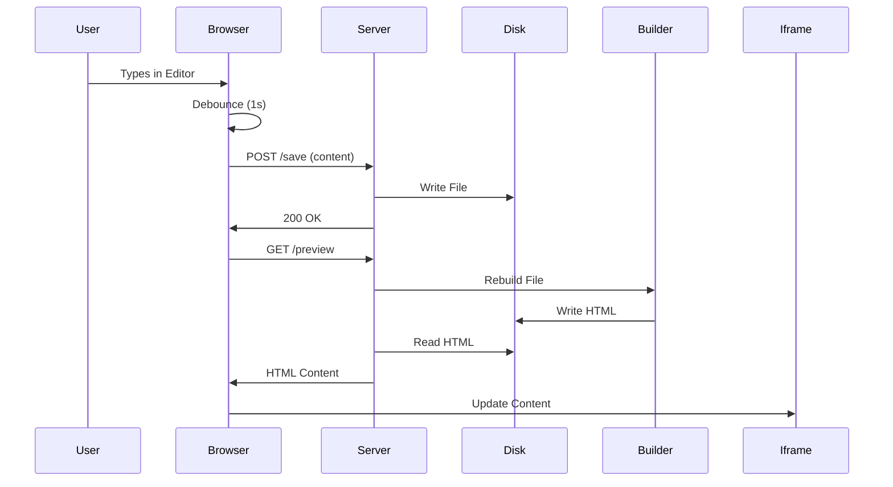

# Research: Blogdown Live Editor

## Unknowns & Clarifications

### 1. Build Performance for Single File
- **Question**: Does `bin/rebuild --file` meet the < 2s latency requirement?
- **Findings**: `Ovid::Site::_build_single_file` currently preprocesses *all* files to build context (tags, RSS, etc.). This might be slow.
- **Decision**: We will use `bin/rebuild --file` initially. If too slow, we will optimize `Ovid::Site` to cache context or skip non-essential steps for preview (e.g., RSS, pagination).
- **Rationale**: Reusing existing logic ensures fidelity (FR-006). Optimization can be done if needed.

### 2. Web Framework Integration
- **Question**: How to integrate Dancer2?
- **Findings**: `Dancer2` is not in `cpanfile`. `Mojolicious` is present.
- **Decision**: Add `Dancer2` to `cpanfile` as requested by user.
- **Rationale**: Explicit user preference.

### 3. Frontend Implementation
- **Question**: How to implement the editor and preview sync?
- **Findings**: Requirement is "auto-save to disk (debounced ~1s)".
- **Decision**: Simple HTML page with a `<textarea>` and an `<iframe>` for preview. Vanilla JavaScript to handle `input` event, debounce, POST to `/save`, then trigger preview refresh.
- **Rationale**: Keeps it simple, no build step for frontend (React/Vue not needed).

### 4. File Identification
- **Question**: How to identify the file to edit?
- **Findings**: CLI argument `launch <path>`.
- **Decision**: The `launch` script will resolve the path to an absolute path and pass it to the Dancer2 app (e.g., via environment variable or config).
- **Rationale**: Simple and effective.

## Technology Choices

- **Backend**: Dancer2 (Perl)
- **Frontend**: HTML5 + Vanilla JS + CSS (minimal)
- **Communication**: HTTP (POST /save, GET /preview)
- **Build Integration**: Invoke `bin/rebuild --file` via `system` or `Ovid::Site` module directly.

## Architecture

